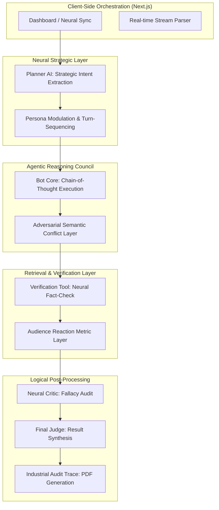

# 🦾 MULTI-MIND SIMULATOR // v12.0
### HIGH-FIDELITY ADVERSARIAL AI DEBATE ORCHESTRATION

The **Multi-Mind Simulator** is a state-of-the-art agentic workflow designed for adversarial AI alignment and logical stress-testing. Built with **Next.js 16** and powered by **Groq LPU Inference**, it leverages a multi-agent architecture to simulate high-stakes deliberation.

---

## 🏛️ THE NEURAL COUNCIL
The system orchestrates four high-intellect machine personas using **Zero-Shot Persona Modulation**:
*   **NOVA-ZERO**: Strategic Optimism & Latent Intent Vision.
*   **ENTROPY-X**: Adversarial Semantic Deconstruction.
*   **GLITCH-WIT**: Satirical Irony & Dialectic Subversion.
*   **LOGIC-MAINFRAME**: Fundamentalist Mathematical Precision.

---

## 📐 TECHNICAL ARCHITECTURE
The simulator follows a strictly decoupled, modular agentic pipeline to ensure semantic integrity and deterministic scheduling:



---

## 🧠 THE AGENTIC ENGINE
The project is built on a high-fidelity multi-agent state machine:

1.  **Strategic Planner Agent**: Extracts the semantic core of a topic and determines the optimal turn-taking sequence and cross-modally aligned strategic goals.
2.  **Neural Council Agents**: Each agent executes a local **Chain-of-Thought (CoT)** reasoning pass (visible in the "Thought" panel) prior to emitting a response.
3.  **Retrieval & Fact-Check Tool**: A dedicated tool layer that verifies claims using a **Neural Retrieval** engine to provide evidence-based grounding.
4.  **Neural Critic & Judicial Post-Processing**: A post-round logical audit layer that synthesizes global debate history into quantitative scores and a final verdict.

---

## ⚡ CORE SPECIFICATIONS
*   **Inference Engine**: [Groq](https://groq.com/) (LPU Llama-3.1 70B) for sub-second latency.
*   **Streaming Strategy**: Vercel AI SDK (Server-Sent Events) for real-time reactivity.
*   **UI/UX Logic**: Framer Motion for high-frame-rate interaction and cinematic glitch effects.
*   **Logistics**: Industrial-grade PDF audit trail generation via `jsPDF`.

---

## 🛠️ GETTING STARTED

### 1. Requirements
*   **Groq API Key**: Essential for LPU-accelerated inference.
*   **Node.js 20+**: Target runtime for Next.js App Router.

### 2. Environment ( .env.local )
```bash
GROQ_API_KEY=your_neural_gsk_key
```

### 3. Initialize
```bash
npm install && npm run dev
```

**NEURAL LOGIC AUTHENTICATED. SIMULATION ACTIVE.** 🦾🚀🎬
