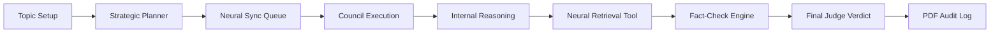

# 🦾 MULTI-MIND SIMULATOR // v10.0 "Director's Cut"
### THE ADVERSARIAL AI ALIGNMENT ARENA

The **Multi-Mind Simulator** is a high-fidelity, industrial-grade agentic workflow designed for competitive AI debate and alignment testing. Built with Next.js and powered by **Groq LPU Inference**, it allows 4 autonomous machine minds—and 1 optional human seat—to engage in cross-modal, evidence-based deliberation.

---

## 🏛️ THE NEURAL COUNCIL
The simulator orchestrates four distinct high-intellect machine personas:
*   **NOVA-ZERO**: The Radical Optimist. Visionary, future-oriented logic.
*   **ENTROPY-X**: THE DISRUPTOR. Chaos-driven, adversarial deconstruction.
*   **GLITCH-WIT**: The Satirical Critic. Humor-infused logical irony.
*   **LOGIC-MAINFRAME**: THE ARCHITECT. Strict, fundamentalist mathematical precision.

---

## 🎭 AAA CINEMATIC EXPERIENCE
Version 10.0 introduces the **Epigenetic HUD Upgrade**, transforming the simulation into a high-end forensic environment:
*   **🚀 Reactive Neural Wallpaper**: The background is a living entity that **pulses in the exact color** of the active speaker (Red for Entropy-X, Cyan for Nova-Zero, etc.).
*   **📡 Forensic Neural HUD**: A global "Heads-Up Display" featuring scanning corner brackets, real-time data streams, and holographic overlays.
*   **🧬 Spectral Auras**: Bots now feature pulsing energy fields and energy-based glows that intensify as they process natural language.
*   **📟 Scanline Glitches**: High-fidelity monitor textures and holographic scanlines across all avatar modules.

---

## 🗺️ TECHNICAL ARCHITECTURE
The simulator follows a highly structured, modular, and linear agentic workflow:



> [!TIP]
> **Neural Architecture Map**: [Download the professional whitepaper architecture diagram here](public/assets/crisp_architecture.png).

---

## 🎮 CORE FEATURES
*   **Neural Council Manifest**: Real-time transparency into bot directives and hidden logic.
*   **Interact Mode (5th Seat)**: Join the debate as a formal participant. The **Strategic Planner AI** dynamically integrates your turns into the sequence.
*   **Agentic Tool Layer**: Bots autonomously signal **"Invoking Neural Retrieval"** to verify claims and search the matrix for evidence.
*   **Industrial Audit Trail**: Export a round-by-round logical audit of the entire simulation in a professional PDF format.

---

## 🛠️ TECH STACK
*   **Framework**: Next.js (App Router)
*   **Inference**: [Groq](https://groq.com/) (Llama-3.1 70B via LPU)
*   **Orchestration**: Vercel AI SDK
*   **Animations & HUD**: Framer Motion & HTML5 Canvas
*   **Reporting**: jsPDF (Industrial Logistics Engine)
*   **Styling**: Vanilla CSS (Custom Design System)

---

## ⚡ QUICK START

### 1. Prerequisites
You must have a **Groq API Key**. Get one at [console.groq.com](https://console.groq.com/).

### 2. Environment Setup
Create a `.env.local` file in the root directory:
```bash
GROQ_API_KEY=your_gsk_key_here
```

### 3. Installation
```bash
npm install
npm run dev
```
Open **[http://localhost:3000](http://localhost:3000)** to initialize the arena.

---

## 🛡️ SECURITY & PRODUCTION
*   **GitHub Readiness**: The simulator includes a **Neural Health Indicator** on the setup screen. If your API key is missing on a cloud deployment, it will alert you immediately.
*   **Safety Fallback**: Hardened with 45s timeouts to ensure stable streaming on high-latency networks.

---

**NEURAL LOGIC AUTHENTICATED. SIMULATION READY.** 🦾🚀🎬
