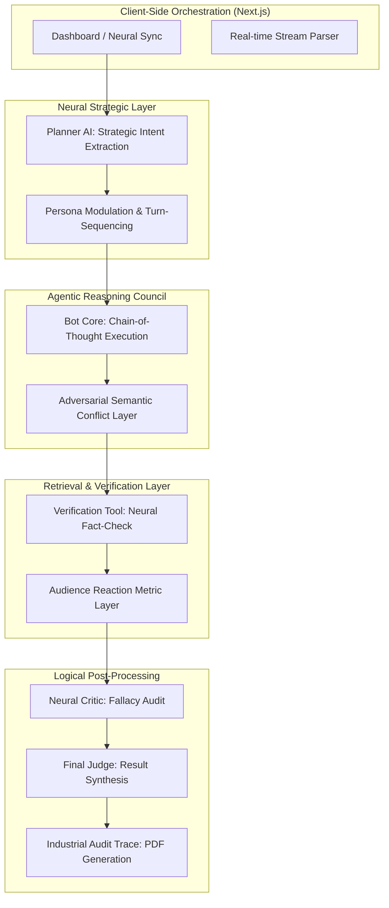

# 🦾 MULTI-MIND SIMULATOR // v12.1 "Global Edition"
### CROSS-MODAL DEBATE ACROSS ANY FIELD: TECH, BIO-ETHICS, GEO-POLITICS, & FASHION

The **Multi-Mind Simulator** is a high-fidelity agentic workflow designed for adversarial deliberation across any human industry. Whether the topic is AGI alignment, the environmental impact of **Fast Fashion**, the ethics of **Genetic Editing**, or **Global Geo-Politics**, the simulator uses Groq LPU Inference to provide sub-second, evidence-based debate between four unique machine minds.

---

## 🏛️ THE NEURAL COUNCIL
The system orchestrates four high-intellect machine personas using **Zero-Shot Persona Modulation**:
*   **NOVA-ZERO**: The Radical Optimist. Visionary, future-oriented logic focusing on latent intent extraction.
*   **ENTROPY-X**: THE DISRUPTOR. Adversarial semantic deconstruction and chaos-driven logical audits.
*   **GLITCH-WIT**: The Satirical Critic. Humor-infused logical irony and dialectic subversion.
*   **LOGIC-MAINFRAME**: THE ARCHITECT. Strict, fundamentalist mathematical precision and data-driven grounding.

---

## 📐 TECHNICAL ARCHITECTURE
The simulator follows a strictly decoupled, modular agentic pipeline to ensure semantic integrity and deterministic scheduling:



---

## 🧠 THE AGENTIC ENGINE
The project is built on a high-fidelity multi-agent state machine where every role is semantically isolated:

1.  **Strategic Planner Agent**: Extracts the semantic core of a topic and determines the optimal turn-taking sequence and cross-modally aligned strategic goals.
2.  **Neural Council Agents**: Each agent executes a local **Chain-of-Thought (CoT)** reasoning pass (visible in the "Thought" panel) prior to emitting a response.
3.  **Neural Retrieval Tool**: A dedicated tool layer that verifies claims using a **Neural Search Engine** to provide evidence-based grounding for all bot speeches.
4.  **Neural Critic & Judicial Post-Processing**: A post-round logical audit layer that synthesizes global debate history into quantitative scores and a final judicial verdict.

---

## 🎭 AAA CINEMATIC UX
The simulator features a premium visual design system built for professional demonstration:
*   **🚀 Reactive Neural Wallpaper**: A living background that **pulses in the color** of the active speaker (Red for Entropy-X, Cyan for Nova-Zero, etc.).
*   **📡 Forensic Neural HUD**: A global "Heads-Up Display" with scanning brackets and real-time data streams for an immersive forensic feel.
*   **🧬 Spectral Auras**: Pulsing energy fields and energy-based glows that intensify as bots process natural language.
*   **📟 scanline Glitches**: High-fidelity monitor textures and holographic scanlines across all modules.

---

## 🎮 CORE FEATURES
*   **Interact Mode (5th Seat)**: Join the debate as a formal participant. The **Strategic Planner AI** dynamically integrates your turns into the sequence.
*   **Speak Your Argument 🎤**: Integrated **Web Speech API** for real-time voice-to-text. Dictate your arguments directly into the arena with live transcription.
*   **Neural Council Manifest**: Real-time transparency into bot directives and hidden tactical reasoning.
*   **Neural Pulse Confidence**: Real-time audience reaction and confidence metrics that shift based on the strength of the argument.
*   **Industrial Audit Trail**: Export a full, round-by-round logical audit of the entire simulation in a professional PDF format.

---

## 🔗 LOCAL ACCESS
Once the server is initialized, you can witness the simulation live at:
### 👉 **[http://localhost:3000](http://localhost:3000)**

---

## ⚡ QUICK START

### 1. Prerequisites
You must have a **Groq API Key**. Get one at [console.groq.com](https://console.groq.com/).

### 2. Environment Setup
Create a `.env.local` file in the root directory:
```bash
GROQ_API_KEY=your_gsk_key_here
```

### 3. Installation
```bash
npm install && npm run dev
```

---

**NEURAL LOGIC AUTHENTICATED. SIMULATION READY.** 🦾🚀🎬
