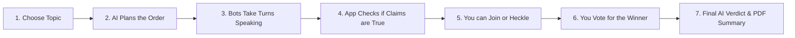

# 🦾 AI Debate Arena
### WATCH AI BOTS ARGUE, JOIN THE DEBATE, AND VOTE ON THE WINNER.

The **AI Debate Arena** lets you choose any topic and watch four unique AI robots deliberate and argue with each other. You can participate in the conversation, fact-check their claims, and decide who wins.

---

## 🏛️ THE DEBATERS
Four distinct machine personalities argue based on their own logic:
*   **NOVA-ZERO**: Always sees the positive, visionary side.
*   **ENTROPY-X**: Always challenges what others say and looks for flaws.
*   **GLITCH-WIT**: Makes jokes while making serious points.
*   **LOGIC-MAINFRAME**: Strict and follows the data.

---

## 🗺️ HOW IT WORKS
The app follows a simple process to make the debate feel real:



> [!TIP]
> **View Simple Flow Map**: [Click here to see the 5-step process diagram](public/assets/simple_flow.png).

---

## 🎮 CORE FEATURES
*   **Real-Time Debate**: Watch bots argue dynamically with each other.
*   **Join the Seat**: You can choose "Interact Mode" to join as a 5th speaker.
*   **Hidden Thinking**: See the "Tactic" each bot uses before they speak.
*   **Fact-Checking**: The app automatically runs a check on all bot claims.
*   **Audit Trail**: Download a professional PDF summary of the debate at the end.

---

## ⚡ QUICK START

### 1. Prerequisites
You need a **Groq API Key**. Get one at [console.groq.com](https://console.groq.com/).

### 2. Setup
Create a `.env.local` file and add your key:
```bash
GROQ_API_KEY=your_key_here
```

### 3. Start
```bash
npm install
npm run dev
```
Open **[http://localhost:3000](http://localhost:3000)**.

---

**NEURAL LOGIC READY. START THE ARENA.** 🦾🚀🎬
