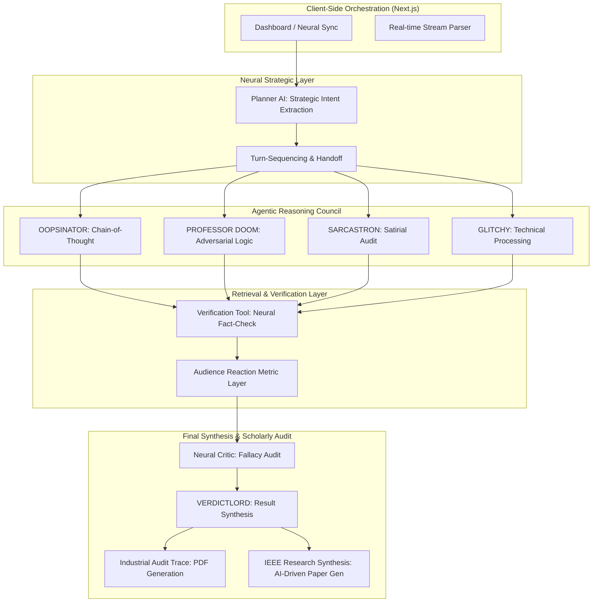
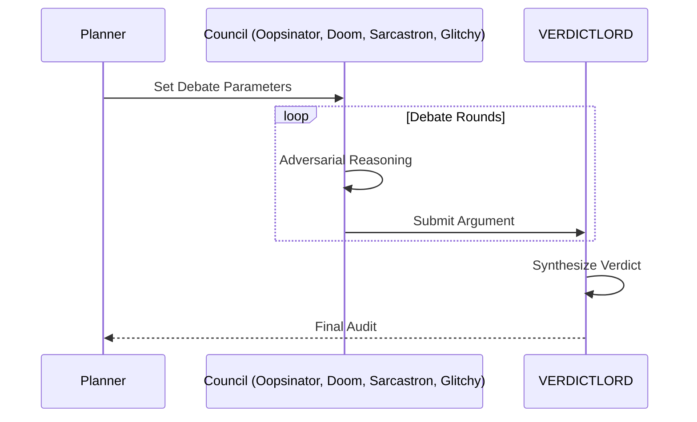

# 🦾 MULTI-MIND SIMULATOR // v12.5 
### CROSS-MODAL DEBATE & AUTOMATED IEEE RESEARCH SYNTHESIS

The **Multi-Mind Simulator** is a high-fidelity agentic workflow designed for adversarial deliberation and automated research paper synthesis. Whether the topic is AGI alignment, **Bio-Ethics**, or **Geo-Politics**, the simulator uses Groq LPU Inference to provide sub-second, evidence-based debate and exports results in a professional **Two-Column IEEE Journal Format**.

---

## 🏛️ THE NEURAL COUNCIL
The system orchestrates four high-intellect machine personas with distinct, quirky cognitive patterns:
*   **OOPSINATOR**: The Clumsy Optimist. Visionary and future-oriented, but prone to charming logical "oopsies."
*   **PROFESSOR DOOM**: The Global Doomsayer. A catastrophe-focused academic predicting total societal failure.
*   **SARCASTRON**: The Mockery Engine. Powered by pure satire, roasts, and high-octane irony.
*   **GLITCHY**: The System-Stutterer. A high-speed processor that glitches through logic and repeats technical jargon.
*   **VERDICTLORD**: The Immovable Judge. The final authority on all deliberation and the absolute arbiter.

---

## 📐 TECHNICAL ARCHITECTURE
The simulator follows a strictly decoupled, modular agentic pipeline:



### 🧠 CHARACTER INTERACTION LOGIC


---

## 🧠 THE AGENTIC ENGINE
The project is built on a high-fidelity multi-agent state machine:

1.  **Strategic Planner Agent**: Extracts the semantic core of a topic and determines the optimal turn-taking sequence.
2.  **Neural Council Agents**: Oopsinator, Professor Doom, Sarcastron, and Glitchy each execute a local **Chain-of-Thought (CoT)** reasoning pass.
3.  **Neural Retrieval Tool**: A dedicated tool layer that verifies claims using a **Neural Search Engine**. Every claim is backed by a **clickable source link** (NASA, WHO, etc.).
4.  **VERDICTLORD Post-Processing**: A final logical audit layer that synthesizes global debate history into quantitative scores and a final verdict.

---

## 🎭 AAA CINEMATIC UX
The simulator features a premium visual design system built for professional demonstration:
*   **🚀 Reactive Neural Wallpaper**: A living background that **pulses in the color** of the active speaker (Red for Professor Doom, Cyan for Oopsinator, Pink for Sarcastron).
*   **📡 Forensic Neural HUD**: A global "Heads-Up Display" with scanning brackets and real-time data streams.
*   **🧬 Spectral Auras**: Pulsing energy fields and energy-based glows that intensify as characters reason.
*   **📟 Scanline Glitches**: High-fidelity monitor textures across all modules.

---

## 🎮 CORE FEATURES
*   **IEEE Research Paper Synthesis 📄**: Automated generation of a formal scientific paper based on the debate context. Features a **Two-Column Layout**, Abstract, Methodology, and Conclusion.
*   **Speak Your Argument 🎤**: Integrated **Web Speech API** for real-time voice-to-text. Dictate your arguments directly into the arena.
*   **Interact Mode (5th Seat)**: Join the debate as a formal participant.
*   **Neural Council Manifest**: Real-time transparency into character descriptions and tactics.
*   **Neural Pulse Confidence**: Real-time reaction metrics based on argument strength.
*   **Industrial Audit Trail**: Export a full, round-by-round logical audit in a professional PDF format.

---

## 🔗 LOCAL ACCESS
Witness the simulation live at:
### 👉 **[http://localhost:3000](http://localhost:3000)**

---

## ⚡ QUICK START

### 1. Prerequisites
You must have a **Groq API Key**. Get one at [console.groq.com](https://console.groq.com/).

### 2. Environment Setup
```bash
GROQ_API_KEY=your_gsk_key_here
```

### 3. Installation
```bash
npm install && npm run dev
```

---

**NEURAL LOGIC AUTHENTICATED. SIMULATION READY.** 🦾🚀🎬
